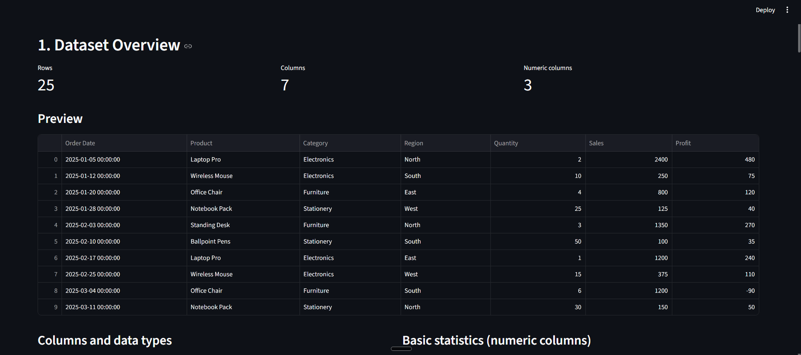
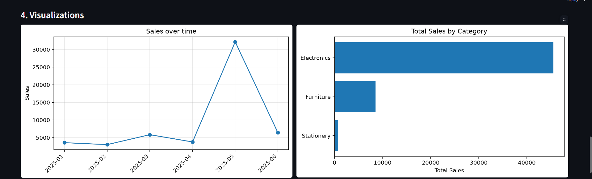
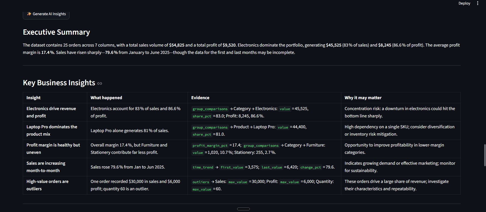
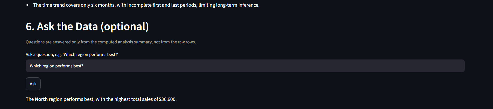

# 📊 AI Data Analyst

An automated data analyst built with Python and Streamlit. Upload any CSV file and get instant dataset analysis, KPIs and charts, followed by plain-language business insights written by an open-weight AI model (**GPT-OSS 20B via Groq**).

## Overview

Exploring a new dataset is slow, and non-technical users often don't know what to look for. Asking a chatbot to "analyze my data" directly is risky because language models can make up numbers.

**AI Data Analyst** solves this by separating the work into two parts:

- **Pandas does the calculating.** Every number (totals, averages, group comparisons, trends, outliers, correlations) is computed in Python.
- **GPT-OSS 20B does the interpreting.** The model receives only these verified findings and explains what they may mean for a business.

## Workflow

```text
CSV Upload
    ↓
Pandas Analysis
    ↓
Metrics & Visualizations
    ↓
GPT-OSS 20B via Groq
    ↓
AI Business Insights
```

1. The user uploads a CSV file.
2. Pandas analyzes it and builds a compact summary of verified findings.
3. The app shows metrics, data-quality checks and charts from that summary.
4. The same summary is sent to GPT-OSS 20B through the Groq API.
5. The model returns a structured business report.

## The Role of the Open-Weight AI

GPT-OSS 20B is used as an **interpretation layer**, not a calculator. It never sees the raw rows, only the summary calculated by Pandas. It turns those findings into:

- an executive summary
- key business insights (what happened, evidence, why it may matter)
- interesting patterns
- potential anomalies
- questions worth investigating
- recommended actions
- limitations of the data

The prompt instructs the model to use only numbers present in the summary, to avoid claiming causation, and to say so when something cannot be determined. The model name is set in one line in `ai_analysis.py`, so it can be swapped easily.

## Features

- Works with any CSV file the user uploads (not tied to one dataset)
- Dataset overview: row and column counts, preview, data types, basic statistics
- Data quality checks: missing values, duplicate rows, constant columns
- Automatic detection of common business columns (sales, revenue, profit, quantity, product, category, region, date), with generic fallbacks when these names don't exist
- Business metrics: totals, averages, medians, group comparisons, time trend, outliers and correlations
- Automatic Matplotlib charts (time trend and category/region comparisons when suitable columns exist)
- AI Business Insights generated by GPT-OSS 20B
- "Ask the Data" box that answers questions from the computed summary
- Friendly error messages for empty or invalid CSVs and for a missing or failing API key. The data analysis and charts still work if the AI is unavailable.

## Demo / Screenshots

Screenshots below use `sample_data/sales.csv`.

### 1. Dataset Overview
Row, column and numeric-column counts, a data preview, and column types.



### 2. Automatic Visualizations
Charts are created automatically from the detected date and category columns.



### 3. AI Business Insights
GPT-OSS 20B turns the verified Pandas findings into an executive summary and a table of insights. Each insight cites its evidence from the calculated data.



### 4. Ask the Data
Ask a question in plain English and get an answer based on the computed analysis.



## Tech Stack

| Technology | Purpose |
|---|---|
| Python | Core language |
| Streamlit | Web interface |
| Pandas | Data loading and all factual calculations |
| Matplotlib | Charts |
| Groq API | Hosts and serves the model |
| GPT-OSS 20B (`openai/gpt-oss-20b`) | Open-weight model that interprets the findings |
| python-dotenv | Loads the API key from a `.env` file |

## Project Structure

```text
AI-Data-Analyst/
├── app.py              # Streamlit interface
├── data_analysis.py    # Pandas analysis and summary builder
├── ai_analysis.py      # Groq / GPT-OSS 20B integration
├── visualizations.py   # Matplotlib charts
├── requirements.txt
├── README.md
├── LICENSE
├── .gitignore
├── .env.example        # Template for the API key
├── sample_data/
│   └── sales.csv       # Demo dataset for testing
└── screenshots/        # Images used in this README
    ├── overview.png
    ├── visualizations.png
    ├── ai_insights.png
    └── ask_ai.png
```

## Run Locally

**1. Clone the project and create a virtual environment**

```bash
git clone <your-repo-url>
cd AI-Data-Analyst
python -m venv venv
```

Activate it:

```bash
# Windows
venv\Scripts\activate
# macOS / Linux
source venv/bin/activate
```

**2. Install dependencies**

```bash
pip install -r requirements.txt
```

**3. Set up your Groq API key**

A Groq API key is **required for the AI features** (AI Business Insights and Ask the Data). Create a key in the [Groq Console](https://console.groq.com), then:

```bash
cp .env.example .env        # Windows: copy .env.example .env
```

Open `.env` and add your key:

```text
GROQ_API_KEY=your_groq_api_key_here
```

> 🔒 Keep `.env` private. It is listed in `.gitignore` and must never be committed. Only `.env.example`, which contains a placeholder, is included in the repository.

Without a key, the dataset overview, data quality checks, metrics and charts still work. Only the AI sections are disabled.

**4. Run the app**

```bash
streamlit run app.py
```

**5. Try it**

Upload `sample_data/sales.csv`, or any CSV of your own, then click **Generate AI Insights**.

## Example Workflow

1. Upload a CSV file.
2. Review the overview, data quality and business metrics.
3. Look at the automatic charts.
4. Click **Generate AI Insights** to get the AI report.
5. Ask a follow-up such as "Which region performs best?"

## Limitations

- Column detection is based on column-name keywords. Unusually named columns fall back to generic numeric and categorical analysis.
- The AI sees only the calculated summary, not the raw data, so its insights are limited to what the summary contains.
- AI output should be reviewed before making business decisions.

## Future Improvements

- Export the report as PDF
- Excel file support
- Manual column mapping in the interface
- More chart types and date filters

## License

This project is licensed under the MIT License. See the [LICENSE](LICENSE) file for details.